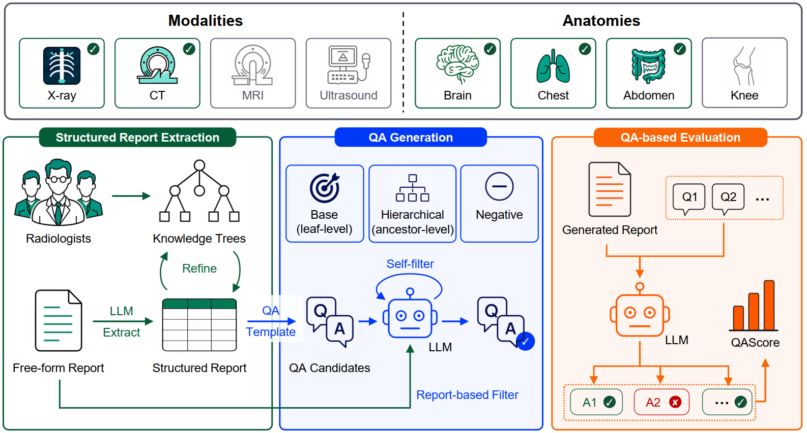

# ReportQA: QA-Based Radiology Report Evaluation

[](tbd) [](https://huggingface.co/datasets/shiym2000/ReportQA) [](./LICENSE)



ReportQA is a clinical-related and flexible radiology report evaluation framework. This repository provides the complete pipeline for:
1. structured report extraction, 
2. QA generation, 
3. QA filtering, 
4. QA-based evaluation.

ReportQA supports radiology report datasets across **any** imaging modality, anatomical region, and language. We release processed datasets including CTRG-Brain (brain CT), CT-RATE (chest CT), AMOS-MM (abdominal CT), and MIMIC-CXR on [Hugging Face](https://huggingface.co/datasets/shiym2000/ReportQA).

Filtered QA pairs can be used not only for radiology report evaluation, but also as **standalone** benchmarks for evaluating vision-language models.

## :package: Installation

``` bash
# 1. clone and navigate
git clone https://github.com/MSIIP/ReportQA.git
cd ReportQA

# 2. create a conda environment, activate it and install packages
conda create -n reportqa python=3.11
conda activate reportqa
pip install -r requirements.txt
```

## :rocket: Getting Started

Take [**CTRG-Brain-zh**](https://github.com/tangyuhao2016/CTRG) as an example:

### 1. Structured report extraction & QA generation

``` bash
# generate qas from free-form reports
bash scripts/generate_qas/generate_qas.sh
```

### 2. QA filtering

``` bash
# deploy the judge model with vLLM
bash scripts/deploy_vllm/deploy_vllm.sh

# self-filter & report-based filter
bash scripts/filter/filter_ctrg_brain_zh.sh
```

### 3. Model inference (Optional)

``` bash
# install `ms-swift` first: https://github.com/modelscope/ms-swift
# zero-shot inference
bash scripts/infer/internvl/infer_ctrg_brain_zh.sh
```

### 4. QA-based evaluation

``` bash
# evaluation & scoring
bash scripts/eval/eval_ctrg_brain_zh.sh
```

## :book: Citation

``` bibtex
TBD
```

## :heart: Acknowledgements

We would like to express our gratitude to the following resources:
+ [**CTRG**](https://github.com/tangyuhao2016/CTRG) - Brain & Chest CT dataset with Chinese & English radiology reports.
+ [**CT-RATE**](https://huggingface.co/datasets/ibrahimhamamci/CT-RATE) - Chest CT dataset with English radiology reports.
+ [**AMOS-MM**](https://era-ai-biomed.github.io/amos/dataset.html#overview) - Abdominal CT dataset with English radiology reports.
+ [**MIMIC-CXR**](https://physionet.org/content/mimic-cxr/2.0.0/) - Chest X-ray dataset with English radiology reports.
+ [**RadEvalX**](https://physionet.org/content/rad-eval-x/1.0.0/) - Chest X-ray dataset with English radiology reports.
